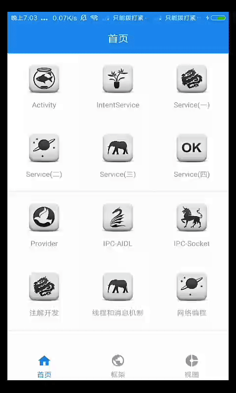

- 常用控件、视图总结 [AndroidViews](https://github.com/javakam/AndroidViews)
- 项目结构 : [app](art) 主工程基于 QMUI Android ; [support](art) 用于测试进程间通信、内容提供者的辅助工程

#### 四大组件
- [Service](app/src/main/java/com/improve/modules/service/Service.md)
- [Activity工作过程](app/src/main/java/com/improve/modules/componet_process/四大组件工作过程.md)
- [Activity管理方式](app/src/main/java/com/improve/base/安全退出已调用多个Activity的App.md)
- [Activity-Token](app/src/main/java/com/improve/modules/activity/Activity-Token.md)
- [ContentProvider共享机制](app/src/main/java/com/improve/modules/provider/ProviderFragment)
- [注解开发](app/src/main/java/com/improve/modules/annotation/注解开发.md)

#### 数据
- [GreenDao 数据库](app/src/main/java/com/improve/modules/greendao)

#### 多线程
- [Android线程和线程池](app/src/main/java/com/improve/modules/thread/Android线程和线程池.md)
- [IntentService 源码分析](app/src/main/java/com/improve/modules/service/intentservice/IntentService源码.md)
- [AsyncTask](app/src/main/java/com/improve/modules/thread/AsyncTaskFragment)
- [AsyncTask缺陷问题](app/src/main/java/com/improve/modules/thread/AsyncTask缺陷问题.md)
- [ThreadLocal](app/src/main/java/com/improve/modules/thread/ThreadLocal.md)

#### 自定义控件
> 工作中总结的自定义组件 [https://github.com/javakam/AndroidViews](https://github.com/javakam/AndroidViews)
- [**相关博客**](app/src/main/java/com/improve/modules/ui_process/自定义View相关博客.md)
- [**UI绘制流程**](app/src/main/java/com/improve/modules/ui_process/UI绘制流程.md)
- [HenCoder 1-3](app/src/main/java/com/improve/modules/ui_hencoder)
- [艺术探索-View基础和事件](app/src/main/java/com/improve/modules/ui_process/art/View基础.md)
- [群英传-View入门案例](app/src/main/java/com/improve/modules/ui_process/heros)
- [事件分发机制](app/src/main/java/com/improve/modules/ui_process/event)
- [DragView视图拖动](app/src/main/java/com/improve/modules/ui_process/dragview)
- [LayoutInflater源码](app/src/main/java/com/improve/modules/ui_process/LayoutInflater源码.md)

 

- [TextView](app/src/main/java/com.improve.modules.widgets.TextViewFragment)
- [AutoCompleteTextView & TextInputLayout](app/src/main/java/com.improve.modules.widgets.AutoCompleteTextViewFragment)
- [AutoCompleteTextView & SpannableString & ImageSpan](app/src/main/java/com.improve.modules.widgets.EditTextFragment)
- [FlexboxLayout基础](app/src/main/java/com.improve.modules.widgets.FlexboxLayoutFragment)
- [FlexboxLayout流式布局](app/src/main/java/com.improve.modules.widgets.CatFlexboxLayoutFragment)
- [SmartTable](app/src/main/java/com/improve/modules/widgets/smarttable)
- [01优酷菜单](app/src/main/java/com/improve/modules/widgets/v01优酷菜单)
- [02广告轮播效果](app/src/main/java/com/improve/modules/widgets/v02广告轮播效果)
- [03自定义下拉框](app/src/main/java/com/improve/modules/widgets/v03自定义下拉框)
- [TextView、FlexboxLayout遇到的问题](app/src/main/java/com/improve/modules/widgets/README.md)
- [Android Window](app/src/main/java/com/improve/modules/window/WindowManagerGlobal中的同步方式.md)

#### RecyclerView
- [RecyclerView](app/src/main/java/com/improve/modules/recyclerview)
- [RecyclerView和ListView的异同](app/src/main/java/com/improve/modules/recyclerview/RecyclerView和ListView的异同.md)

#### 框架
- [ImageLoader图片加载框架](app/src/main/java/com/improve/modules/ui_process/imageloader)
- [ButterKnife使用和原理](app/src/main/java/com/improve/modules/框架/ButterKnife使用和原理.md)

#### 其他
- [EventBus3 线程优先级](app/src/main/java/com/improve/modules/eventbus3)
- [EventBus3 线程模型](app/src/main/java/com/improve/modules/eventbus3)
- [Android进程等级](app/src/main/java/com/improve/modules/process/Android进程等级.md)
- [AIDL通信](app/src/main/java/com/improve/modules/ipc/aidl)
- [Socket通信](app/src/main/java/com/improve/modules/ipc/socket)
- [Parcelable](app/src/main/java/com/improve/modules/service/序列化/Parcelable.md)

#### 待完善
- [Android网络编程](app/src/main/java/com/improve/modules/network/Android网络编程.md)
- [Android增量更新](app/src/main/java/com/improve/modules/network)
- [RxJava2](app/src/main/java/com/improve/modules/rxjava)
- [WebView](app/src/main/java/com/improve/modules/webview)
- 加入动态权限申请

