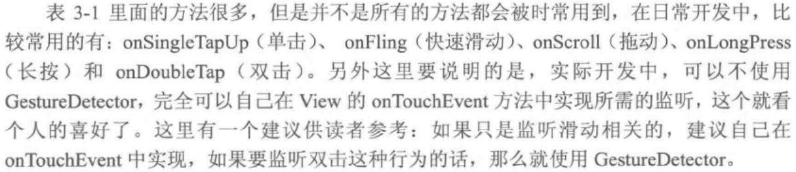
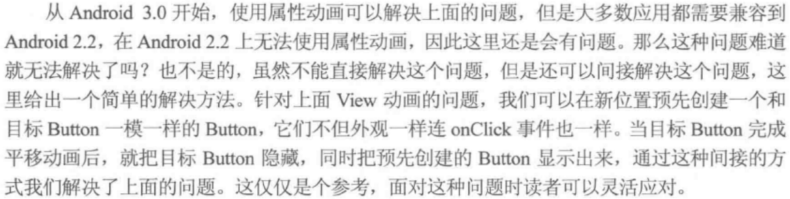
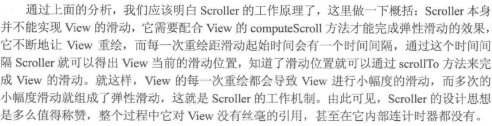
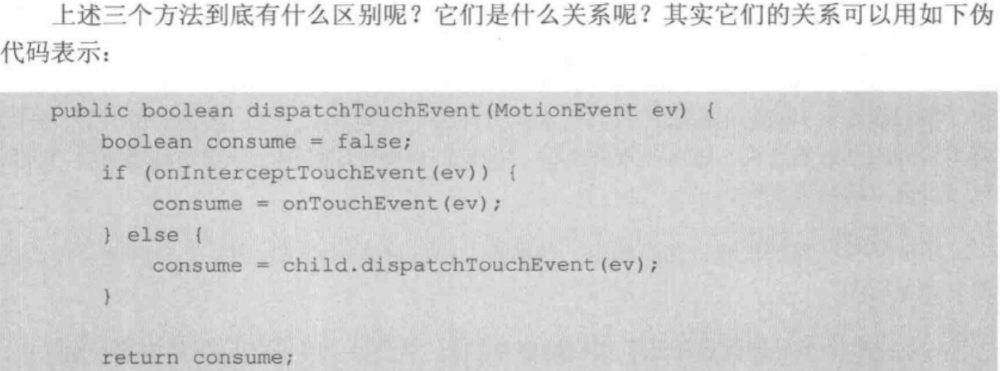
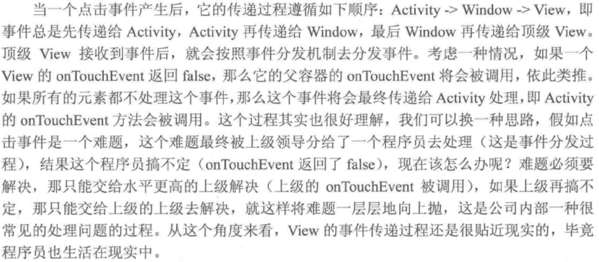
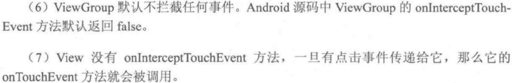
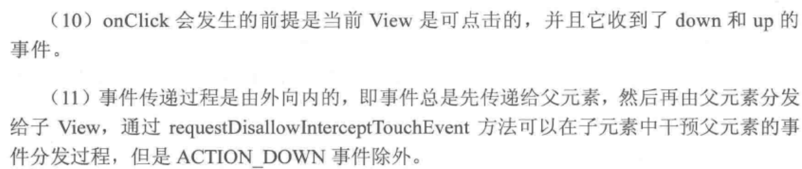
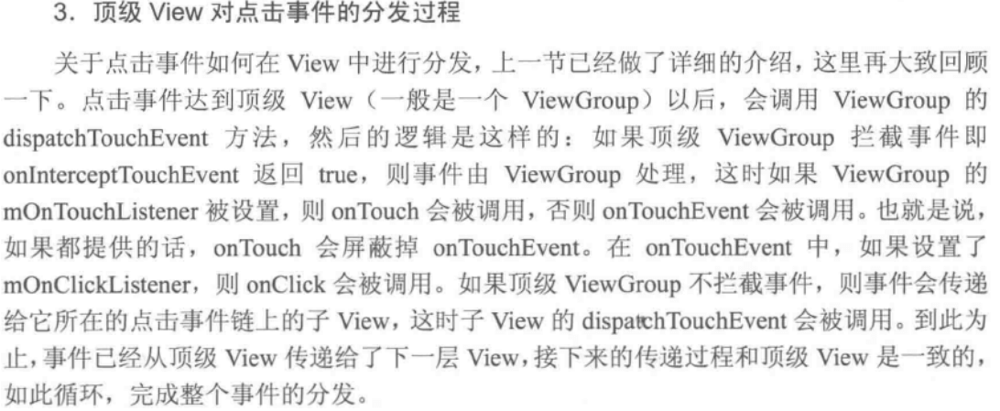
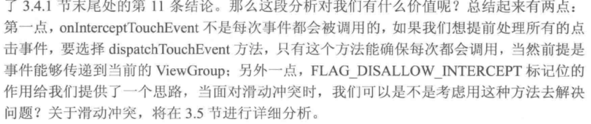

### View基础
---
#### View坐标
- left、top、right、bottom 是相当父容器的坐标！是一种相对坐标。
- View的宽高和坐标关系：
```
width=right-left;
height=bottom-top;
```
- 获取方式 getLeft、getTop...

> Android3.0开始增加的几个参数：x、y、translateX、translateY
x、y是View左上角坐标，tX、tY是View左上角相对父容器的偏移量，tX、tY默认值为0
换算关系：
```
x = left + translateX;
y = top  + translateY;
```
注：View在平移过程中，top和left表示的是原始左上角的位置信息，其值并不会发生改变，此时发生改变的是x、y、translateX、translateY这四个参数。

- MotionEvent 触屏事件
ActionDown ActionMove ActionUp

- TouchSlop 系统可识别出的最小滑动距离。常量。
获取方式
```
ViewConfiguration.get(context).getScaledTouchSlop();
```

- VelocityTracker 速度追踪器

- GestureDetector 手势检测 <br><br>


- Scroller 弹性滑动对象，用于实现View的弹性滑动。
> 优化用户体验，做有过渡效果的滑动。

> Scroller本身无法让View滑动，需要配合 View.computeScroll 方法才能共同完成这个功能。

### View滑动
---
> 实现滑动的三种方式：1.View的scrollTo/scrollBy;2.动画对View施加平移效果;3.改变View的LayoutParams使得View重新布局从而实现滑动。

1.scrollTo/scrollBy
移动的是View内容，而不能移动View本身！
mScrollX、mScrollY :就是指View本身的左边界/下边界，到View内容移动后的距离差值。换算：mScrollX = 本身左/下边界-移动后的内容左/下边界
2.动画方式
【注】View.scrollTo/By动画和帧动画移动的是View的内容，如果想在动画完成后停留在最终位置上，需要设置fillAfter=true，而属性动画移动的就是View本身，不存在这个问题。
还有一点，在Android3.0以下，可以借助nineoldandroid实现属性动画，尽管如此，Android3.0以下的手机通过nineoldandroid实现的属性动画本质上
还是View动画。
```
<?xml version="1.0" encoding="utf-8"?>
<set xmlns:android="http://schemas.android.com/apk/res/android"
    android:fillAfter="true"
    android:zAdjustment="normal">
    <!--此动画可以在100ms内将一个View从原始位置向右下角移动100像素-->
    <translate
        android:duration="100"
        android:fromXDelta="0"
        android:fromYDelta="0"
        android:interpolator="@android:anim/linear_interpolator"
        android:toXDelta="100"
        android:toYDelta="100" />
</set>
```
属性动画
```
//将targetView在100ms内从原始位置向右平移100像素
ObjectAnimator.ofFloat(targetView, "traslationX", 0, 100).setDuration(100).start();
```

- Android低版本（比3.0还低，连nineoldandroid都兼容不了的内种。。。）动画方案



3.改变布局参数 <br><br>


### 弹性滑动
- 使用Scroller滑动

> computeScrollOffset 返回值 true表示滑动未结束；false表示滑动已结束

 <br>

- 使用动画

### 事件分发机制

 <br>
onTouch 返回false，才会触发touch事件：
```
mButton1.setOnTouchListener(new View.OnTouchListener() {
    @Override
    public boolean onTouch(View v, MotionEvent event) {
        return false;
    }
});
```
由此可见，给View设置的OnTouchListener优先级要高于onTouchEvent！

事件处理方法的优先级：onTouchListener 》 onTouchEvent 》 onClickListener

当产生一个点击事件后，事件的传递顺序为：Activity-》Window-》View , 一个贴近现实的例子：<br><br>


事件传递总结：page 143 <br><br>
<br><br>


> 顶级View的事件分发过程

  <br>

- P148 ViewGroup.dispatchTouchEvent 源码分析

 <br><br>

### View的滑动冲突
---
- 外部拦截法

先经过父容器进行拦截处理，适合点击事件的分发机制

- 内部拦截法

父容器不拦截，由子元素负责拦截处理，


### TODO 4.2理解 MeasureSpec   Page 177
2018年7月20日09:42:17

2018年7月23日17:19:33 加油！


