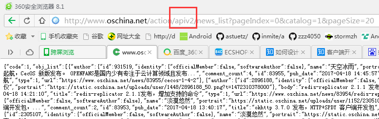

### 迭代开发的时候如何向前兼容新旧接口？
---
设计服务器接口时,每一个接口，都带版本号。比如用户登陆接口第 1 版为:
```
/1/user/login
```
返回 Json 数据。数据结构改动后，假如 Json 数据只是增加字段，这时接口不用修改。
当登陆接口改动太大，会删除或者修改字段。就递增版本号，新添接口:
```
/2/user/login
```
旧的 /1/user/login 接口需要保留,这时旧的客户端使用 /1/user/login，而新的客户端使用 /2/user/login。
在服务端 /1/user/login 和 /2/user/login 进行重构，某些地方调用相同的代码。<br>
两个接口并存一段时间后，比如过了 3 个月。估计旧的客户端差不多都升级到新的了，这时旧的 /1/user/login 接口就可以不再维护，直接返回错误码。<br>
比如开源中国开发也是如此，开源中国API接口如下：<br>
 <br>
 <br>


